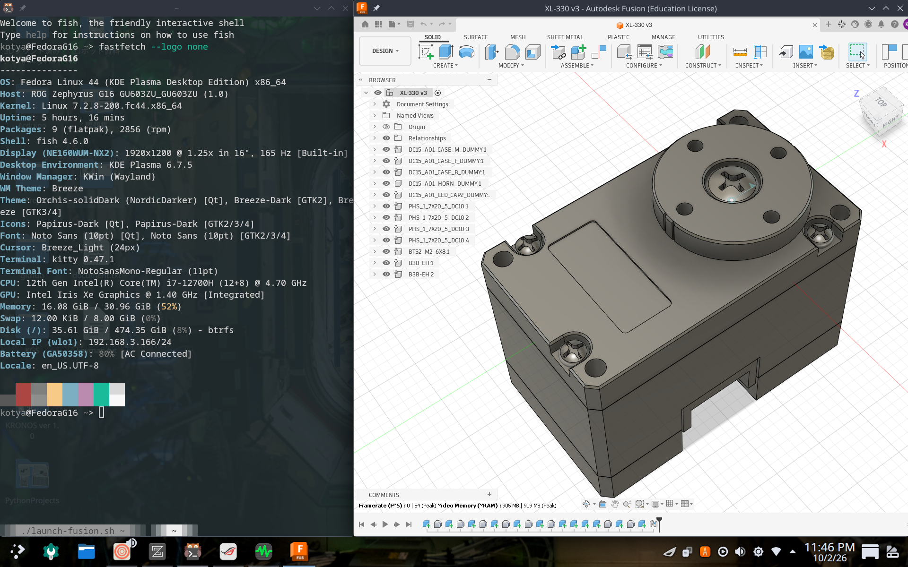
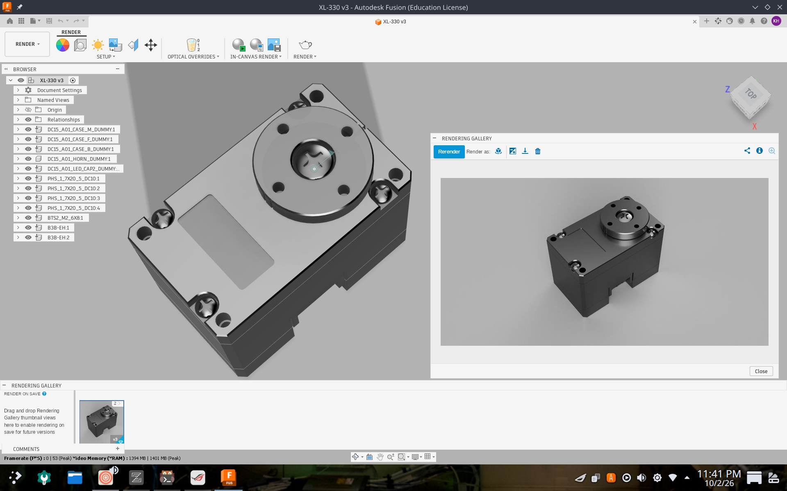
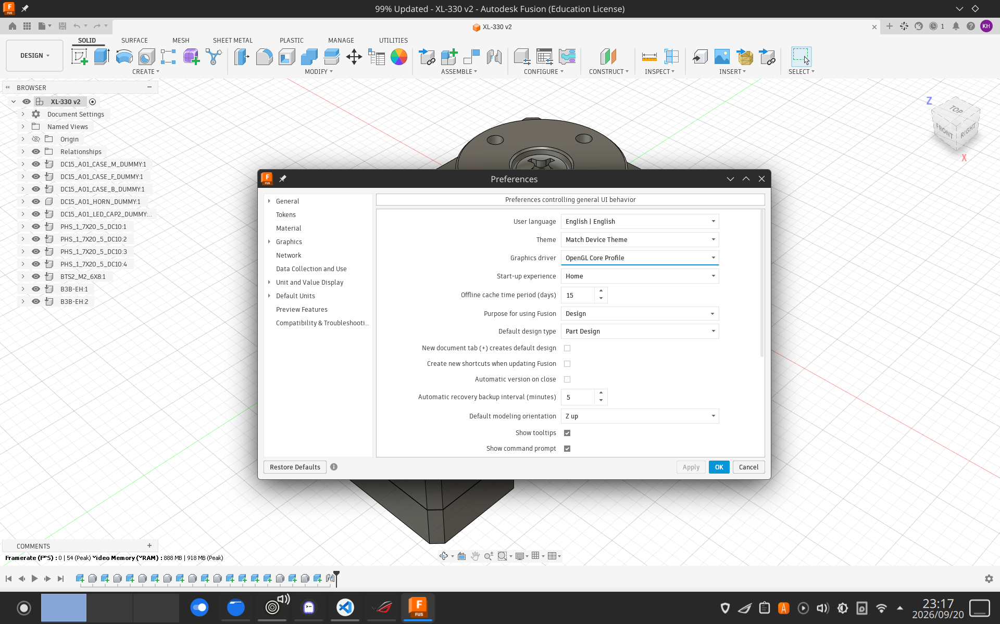

    _______          _              __   _____   _____
	|  ____|        (_)            /_ | /  _  \ /  _  \
	| |__ _   _ ___  _  ___  _ __   | | \ (_) / | | | |
	|  __| | | / __|| |/ _ \| '_ \  | | /  _  \ | | | |
	| |  | |_| \__ \| | (_) | | | | | ||  (_)  || |_| |
	|_|   \__,_|__ /|_|\___/|_| |_| |_| \_____/ \_____/

						 Turn Fusion 180° toward Linux.


Fusion180 is an unofficial, community-driven guide and script set for running **Autodesk Fusion** natively on Linux, using **Steam + GE-Proton** instead of a plain Wine/DXVK prefix.




---

## Before You Start

This project does **not** include the Autodesk Fusion installer.

Due to Autodesk's license terms, you must download the latest installer yourself from the [official Autodesk website](https://www.autodesk.com/products/fusion-360/overview).

**On Linux, you may not be able to download it. If you install an extension like [this](https://addons.mozilla.org/en-US/firefox/addon/user-agent-string-switcher/) to spoof your User-Agent as Windows, you'll be able to download it.**

Place the installer in your `~/Downloads` directory (or point the installer script at its path).

```
~/Downloads/Fusion Client Downloader.exe
```

---

## Prerequisites

### Tested Environment

| Component        | Requirement                          |
|-------------------|---------------------------------------|
| Distro            | Arch(CachyOS, EndeavourOS), Fedora, Debian        |
| Desktop           | KDE Plasma 6                         |
| Display server    | Wayland                              |
| Steam             | Native package (**Flatpak not supported**) |
| Compatibility tool | GE-Proton 11-1, 11-5, 11-6, 11-7                 |

### Hardware Tested On

| Component | Model                         |
|-----------|--------------------------------|
| CPU       | Intel i7-12700H , Intel I5-6500T |
| GPU       | NVIDIA RTX 4050 , Intel Iris Xe , Intel HD Graphics 530 |

---

## Installation

**1. Install required packages and GE-Proton 11-7(or later)**

| Package                        | Notes                          |
|----------------------------------|---------------------------------|
| Autodesk Fusion installer        | Download from [Here](https://www.autodesk.com/products/fusion-360/overview)
| Steam (native version)           | Flatpak build is **not supported** |
| protonup-qt                      | Used to install/manage GE-Proton |
| Fusion Installer (from Autodesk) | Not redistributed — download it yourself |
| python-xlib                      | Refer to the command below |

    Arch/Arch based distros : sudo pacman -S python-xlib
    Fedora                  : sudo dnf install python3-xlib
    Debian                  : sudo apt install python3-xlib


| GPU              | Packages                                              |
|-------------------|--------------------------------------------------------|
| Intel        | `mesa`, `vulkan-intel`                                |
| NVIDIA    | `nvidia-open-dkms` (or `nvidia-dkms`), `nvidia-utils`, `vulkan-icd-loader` |

Open Steam and login.
Open `protonup-qt` and install GE-Proton 11-7(or later). This is a GUI step, no command needed.

**2. Get the Fusion180 scripts**

```bash
git clone https://github.com/Kotya31415/Fusion180.git
cd Fusion180
chmod +x installer.sh launch-fusion.sh
```

**3. Download the Fusion installer**

Download the installer from the [official Autodesk website](https://www.autodesk.com/products/fusion-360/overview) and place it in `~/Downloads`:

```
~/Downloads/Fusion Client Downloader.exe
```

**4. Run the installer script**

```bash
./installer.sh
```

**5. Launch Fusion**

```bash
~/launch-fusion.sh
```
**6. Set Graphics Driver**


When using OpenGL, DXVK is essentially irrelevant for the corresponding rendering portion of Fusion. \
However, GPU acceleration still function via OpenGL. If you want to use DXVK, you must set Fusion to DirectX 11.\
In my environment, OpenGL works more reliably. (In GE-Proton 11-7)\
**DirectX 11 offers better performance, but it may cause problems. If you encounter any issues, please try OpenGL as well.**

---

## Uninstallation

To remove the Fusion180 prefix created by the installer:

```bash
rm -rf ~/.fusion180
```

This removes the directory at `~/.fusion180`.


## Known Issues

| # | Symptom | Status / Workaround |
|---|----------|----------------------|
| 1 | A login screen appears during Fusion installation. | This is expected — **do not log in here.** Continue the install normally. |
| 2 | After signing in through the browser, Fusion shows a login error on its interface. | This is normal. Click **OK** to continue; you should be signed in correctly afterward. |
| 3 | It may not work properly with AMD graphics cards.  | I'm currently working on a fix. Please let me know if you find a solution! |

**If you run into something not listed here, please open an issue with your distro, kernel version, and full console output.**

---

## Disclaimer

> This project is an unofficial community guide and is not affiliated with or endorsed by Autodesk.
> Fusion is proprietary software and must be downloaded from Autodesk's official website.
